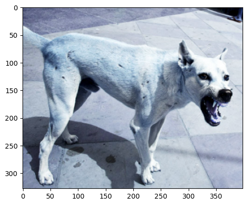
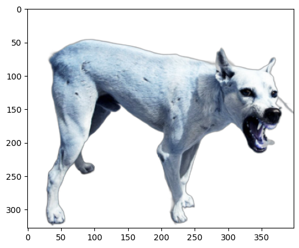
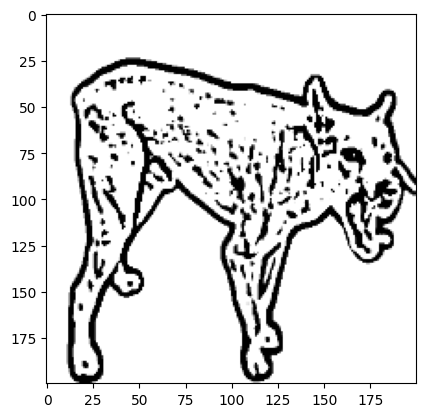

# Mistral ASCII Art

**Mistral-7b model, fine-tuned for generating ASCII art, responds to prompts from a Discord bot.**

Exemple :  

### Prerequisites

- Installing the Discord bot on your favorite server

### Preprocessing

Original image :  

Segmented image :  

Thresholded image :  

Here is the ASCII Art of this dog in text format : [Dog ASCII Art](assets/dog.txt)

## Made with

Fine-tuned on : Mistral-7b model with [mistral-finetune](https://github.com/mistralai/mistral-finetune)

GPU : H100 (thanks to [Nebius](https://nebius.ai/))

* [Python](https://www.python.org)
* [Pytorch](https://pytorch.org) - PyTorch is a machine learning library
* [Mistral-7b](https://mistral.ai/fr/news/announcing-mistral-7b) - Model used

## Authors

* **Maël Reynaud** _alias_ [@DjDonPablo](https://github.com/DjDonPablo)
* **Alexandre Devaux-Rivière** _alias_ [@TopAgrume](https://github.com/TopAgrume)
* **Paul Duhot** _alias_ [@Pauldht](https://github.com/Pauldht)
* **William Peoc'h** _alias_ [@williampeoch](https://github.com/williampeoch)

**Made during Mistral AI hackathon Paris 2024**

## License

MIT License

