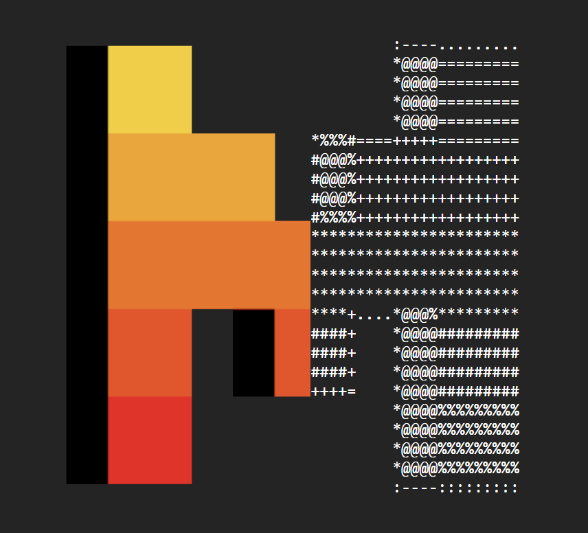
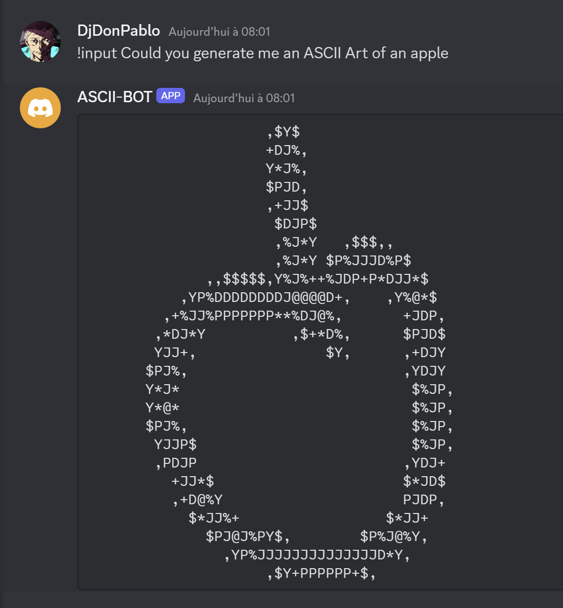

# Mistral ASCII Art

**Mistral-7b model, fine-tuned for generating ASCII art, responds to prompts from a Discord bot.**

Exemple :  

### Prerequisites

- Installing the Discord bot on your favorite server

### Installation

## How to start

## Made with

Fine-tuned on : Mistral-7b model  
GPU : H100

* [Pytorch](https://pytorch.org) - PyTorch is a machine learning library
* [Python](https://www.python.org) - Python is a programming language
* [Mistral-7b](https://mistral.ai/fr/news/announcing-mistral-7b) - Model used

## Authors

* **Prenom Nom** _alias_ [@outout14](https://github.com/blablab)

## License

MIT License

